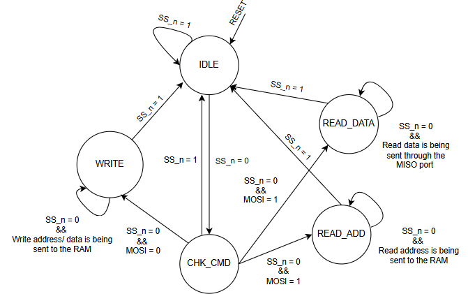

# Project Overview: SPI-SLAVE protocol with single port RAM

## Table of Contents
- [Project Overview: SPI-SLAVE protocol with single port RAM](#project-overview-spi-slave-protocol-with-single-port-ram)
  - [Table of Contents](#table-of-contents)
  - [Outline](#outline)
  - [Design Specifications](#design-specifications)
  - [Data Ports](#data-ports)
  - [Internal Configuration](#internal-configuration)
    - [Overview](#overview)
  - [Serial link management](#serial-link-management)
    - [Slave control](#slave-control)
      - [The serial input from the master side is being handled through a finite state machine elaborated as follows :](#the-serial-input-from-the-master-side-is-being-handled-through-a-finite-state-machine-elaborated-as-follows-)
    - [RAM control](#ram-control)
      - [The design uses single-port synchronous RAM for memory operations \& the serial control is given on the same data bus as follows:](#the-design-uses-single-port-synchronous-ram-for-memory-operations--the-serial-control-is-given-on-the-same-data-bus-as-follows)
  - [Results](#results)
    - [Waveform Snippets](#waveform-snippets)
      - [Write Addredss](#write-addredss)
      - [Write data](#write-data)
      - [Read adddress](#read-adddress)
      - [Read data](#read-data)
    - [Elaboration \& Synthesis](#elaboration--synthesis)
      - [Elaboration](#elaboration)
      - [Synthesis](#synthesis)
        - [Design of the slave](#design-of-the-slave)
        - [Mapping the RAM](#mapping-the-ram)
    - [Implementation](#implementation)
    - [Summary](#summary)
      - [Timing Summary](#timing-summary)
      - [Utilization Summary](#utilization-summary)
      - [Power Summary](#power-summary)
      - [Messages](#messages)
 

## Outline
- This project involves designing and implementing the SPI (Serial Peripheral Interface) protocol with a single port RAM using Verilog. The SPI protocol is a crucial communication interface for short-distance data transfer in embedded systems, while the single port RAM provides efficient memory storage. This documentation outlines the design specifications, implementation details, simulation results,
  
* Tools
    - Questasim
    - Xilinix Vivado  

## Design Specifications

The design of the DSP48A1 slice in the Spartan-6 FPGA involves several critical components and configurations, outlined as follows:

## Data Ports

| Module              | Port Name | Direction  | Data Width | Description                                      |
|---------------------|-----------|------------|------------|--------------------------------------------------|
| **Master-Slave Interface** | MOSI      | Input      | 1 bit       | Master Out Slave In - Data input into slave      |
|                     | MISO      | Output     | 1 bit        | Master In Slave Out - Data output from slave     |
|                     | clk       | Input      | 1 but      | Clock signal for synchronization                 |
|                     | SS_n      | Input      | 1 bit      | Slave Select - To start the serial communication |
|                     | rst_n     | Input      | 1 bit        | Reset signal for initializing the SPI slave      |
| **Single Port RAM** | din       | Input      | 10 bits      | Data input for writing to memory                 |
|                     | dout      | Output     | 8 bits        | Data output for reading from memory              |
|                     | clk       | Input      | 1 bit     | Clock input for synchronizing memory operations  |
|                     | rst_n     | Input      | 1 bit      | Reset signal for initializing the RAM            |

## Internal Configuration
| Module              | Port Name | Direction  | Data Width | Description                                      |
|---------------------|-----------|------------|------------|--------------------------------------------------|
| **Slave-RAM link** | rx_data      | Output      | 10 bit       | Transferred data/address/control from slave to RAM      |
|                     | rx_valid     | Output     | 1 bit        | A flag to make the RAM accept the data on rx bus     |
|                     | tx_data      | Input      | 8 bit      | The data retreived from the RAM                |
|                     | tx_valid     | Input      | 1 bit      | A flag to make the slave convert the tx data to the MISO port |

### Overview
  

## Serial link management

### Slave control
#### The serial input from the master side is being handled through a finite state machine elaborated as follows :

### RAM control
#### The design uses single-port synchronous RAM for memory operations & the serial control is given on the same data bus as follows:
| Port | Din[9:8] | Command | Description                                                                 |
|------|----------|---------|-----------------------------------------------------------------------------|
| din  | 00       | Write   | Hold din[7:0] internally as write address                                   |
|      | 01       | Write   | Write din[7:0] in the memory with write address held previously             |
|      | 10       | Read    | Hold din[7:0] internally as read address                                    |
|      | 11       | Read    | Read the memory with read address held previously, tx_valid should be HIGH, |
|      |          |         | dout holds the word read from the memory, ignore din[7:0]                   |

## Results
### Waveform Snippets
#### Write Addredss
   
#### Write data
  
#### Read adddress
  
#### Read data
 

### Elaboration & Synthesis
#### Elaboration
 
#### Synthesis
 
##### Design of the slave

##### Mapping the RAM
 
### Implementation

### Summary
#### Timing Summary

#### Utilization Summary

#### Power Summary

#### Messages

